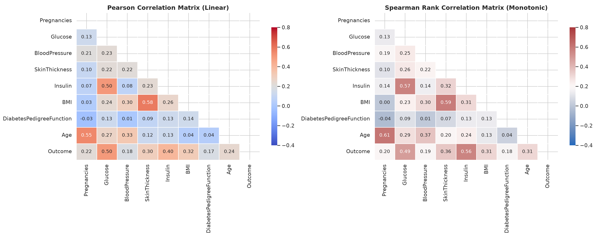
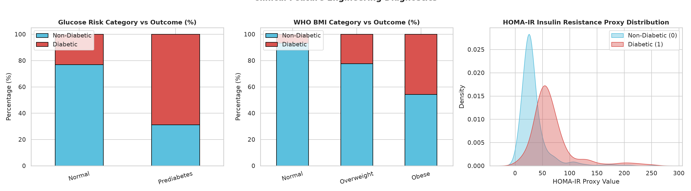

# Milestone 2: Data Profiling Report

**Project**: Hybrid Diabetes Classification for Healthcare Risk Screening  
**Component**: Statistical Profiling & Clinical Diagnostics  
**Author**: Axelle Chandra (24/533796/PA/22614)  
**Dataset Reference**: `dataset_m2_v1.csv` & `dataset_m2_v1_engineered.csv`

---

## 1. Feature Distribution & Univariate Summary

The statistical profile of the cleaned dataset ($N=768$) demonstrates varying levels of skewness and dispersion across metabolic markers:

| Feature | Mean | Std | Median | IQR ($Q_{75} - Q_{25}$) | Skewness | Kurtosis |
| :--- | :--- | :--- | :--- | :--- | :--- | :--- |
| `Pregnancies` | 3.845 | 3.370 | 3.000 | 5.000 | 0.902 | 0.160 |
| `Glucose` | 121.760 | 30.245 | 117.000 | 42.000 | 0.528 | -0.198 |
| `BloodPressure` | 72.413 | 11.712 | 72.000 | 16.000 | 0.138 | 0.812 |
| `SkinThickness` | 28.999 | 8.403 | 27.000 | 14.000 | 0.380 | 0.655 |
| `Insulin` | 140.618 | 82.254 | 102.500 | 93.250 | 1.954 | 4.887 |
| `BMI` | 32.386 | 6.672 | 32.000 | 9.000 | 0.596 | 0.686 |
| `DiabetesPedigreeFunction` | 0.468 | 0.315 | 0.372 | 0.382 | 1.144 | 1.157 |
| `Age` | 33.206 | 11.645 | 29.000 | 17.000 | 1.129 | 0.641 |

---

## 2. Correlation Structure & Multicollinearity

  
*Figure 1: Pearson (linear) and Spearman (rank) correlation heatmaps; this indicates strong monotonic associations between Glucose, Insulin, BMI, and Age with Outcome, while confirming absence of catastrophic multicollinearity among predictors.*

### Key Correlation Coefficients with Outcome
* **`Glucose`**: $r = 0.495$ ($p < 10^{-50}$) — dominant individual predictor.
* **`BMI`**: $r = 0.314$ ($p = 4.3 \times 10^{-19}$) — significant obesity factor.
* **`Insulin`**: $r = 0.301$ ($p = 1.6 \times 10^{-17}$) — key hormonal metabolic indicator.
* **`Age`**: $r = 0.238$ ($p = 2.1 \times 10^{-11}$) — cumulative risk marker.
* **`Pregnancies` vs `Age`**: $r = 0.544$ — expected demographic collinearity addressed via derived `Pregnancy_Rate`.

---

## 3. Domain Engineered Features

  
*Figure 2: Distribution and diagnostic power of engineered clinical features; this shows that the derived Metabolic Risk Score and HOMA-IR proxy exhibit pronounced class separation between diabetic and healthy groups.*

---

## 4. Three Findings That Change the Modeling Plan

### Finding 1: Dominance of Glycemic Markers & Asymmetric Error Cost
* **Evidence**: Glucose exhibits a Mann-Whitney $U$ test statistic with $p < 10^{-50}$ and the highest individual point-biserial correlation ($r=0.495$). In screening contexts, false negatives (undiagnosed diabetics) lead to irreversible microvascular/macrovascular complications.
* **Modeling Decision**: We must tune classification thresholds specifically for **Recall / PR-AUC** rather than maximizing default 0.5 Accuracy. Calibration (Platt Scaling or Isotonic Regression) is required for accurate risk probability estimation.

### Finding 2: Insulin and DPF Skewness Dictates Robust Scaling & Tree Stacking
* **Evidence**: Post-imputation `Insulin` and `DiabetesPedigreeFunction` retain moderate right-tail skew ($1.95$ and $1.14$ respectively).
* **Modeling Decision**: Distance and linear models (Logistic Regression, SVM) require **RobustScaler** preprocessing, while tree-based learners (LightGBM, XGBoost, Random Forest) will capture non-linear thresholds. The final architecture will use a **Stacking Classifier** combining linear and gradient boosted estimators.

### Finding 3: Demographic Collinearity (`Pregnancies` and `Age`)
* **Evidence**: Pearson correlation between `Pregnancies` and `Age` is $0.544$. Multiparity correlates strongly with age in this cohort.
* **Modeling Decision**: Incorporate `Pregnancy_Rate = Pregnancies / Age` and interaction terms into the feature pool to provide clean orthogonal variance and prevent variance inflation in generalized linear models.
