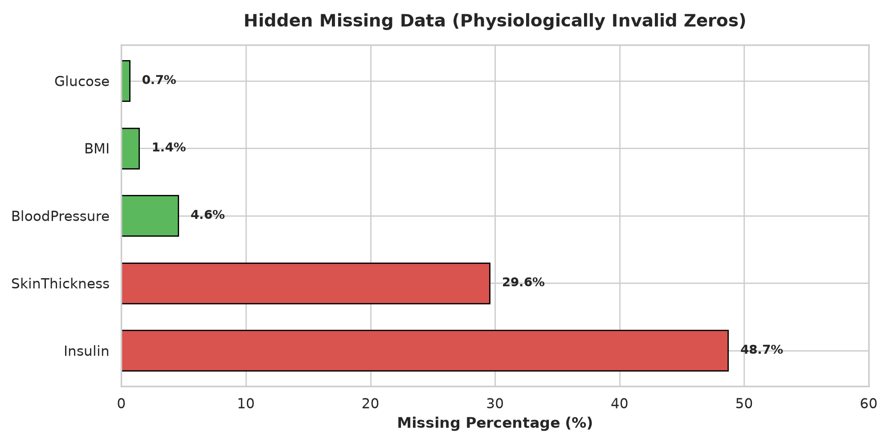
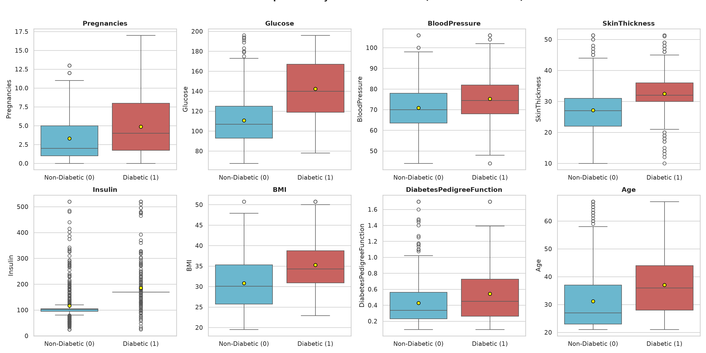
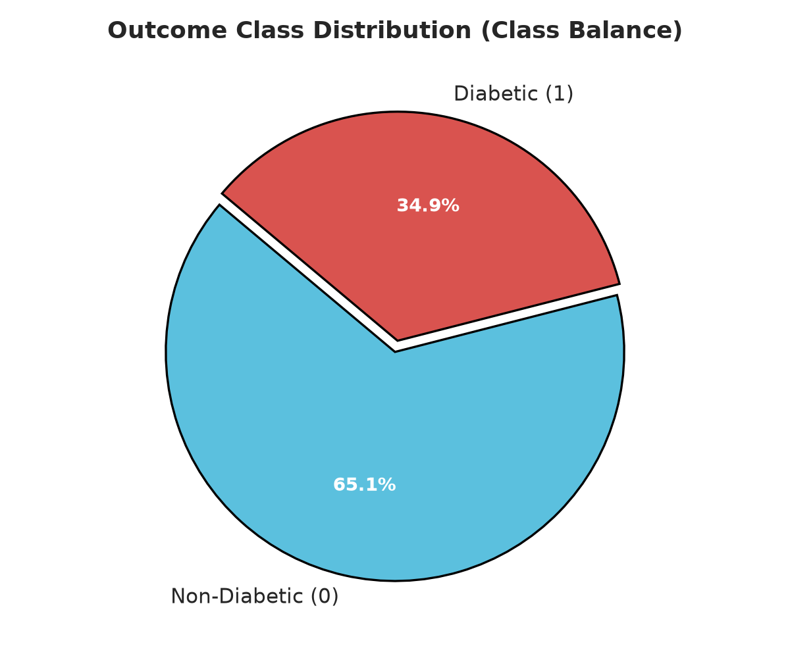
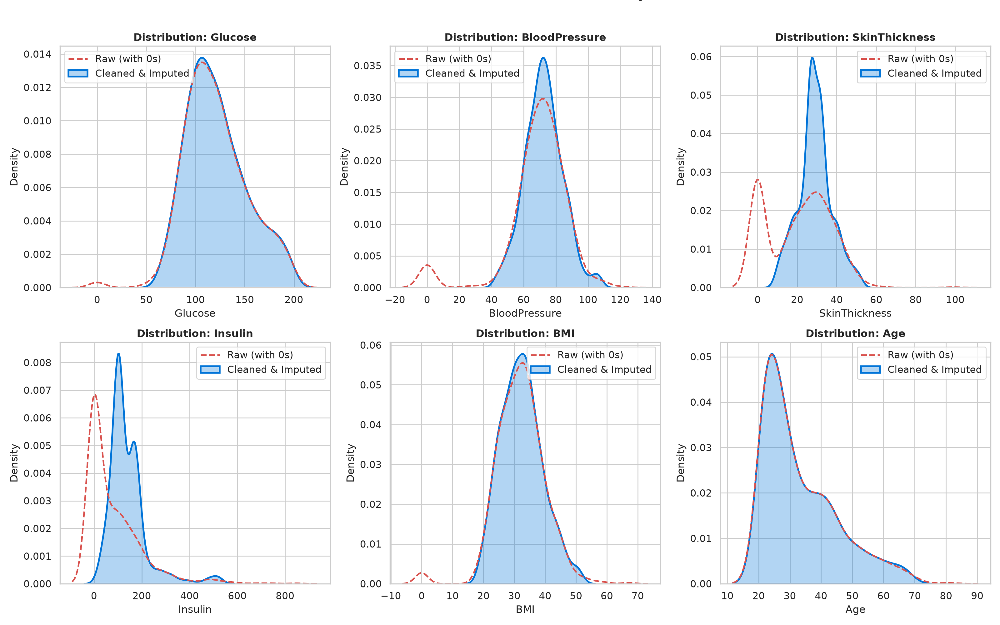

# Milestone 2: Data Quality Report

**Project**: Hybrid Diabetes Classification for Healthcare Risk Screening  
**Component**: Data Engineering & Cleaning Diagnostics  
**Author**: Axelle Chandra (24/533796/PA/22614)  
**Dataset Version**: `dataset_m2_v1.csv` ($N=768$, $D=9$)

---

## 1. Executive Summary & Quality Dimensions

The raw Pima Indians dataset underwent comprehensive diagnostic auditing across four core data quality dimensions:
1. **Completeness**: Identification and resolution of biologically implausible zero values.
2. **Uniqueness**: Assessment of record redundancy and duplicate patient profiles.
3. **Validity**: Enforcement of physiological plausibility boundaries.
4. **Outlier Leverage**: Dampening of extreme values to stabilize downstream estimators.

---

## 2. Missing Value Analysis (Hidden Zero-Missingness)

In the raw dataset, missing clinical observations were masked as numerical zeros. Five physiological attributes exhibit impossible zero values:

### Before and After Cleaning Missing Value Summary Table

| Feature | Raw Count | Raw Zero Count (Missing) | Missingness (%) | Action Taken | Post-Cleaning Valid Count | Post-Cleaning Missing Count (%) |
| :--- | :--- | :--- | :--- | :--- | :--- | :--- |
| **`Insulin`** | 768 | 374 | **48.70%** | Outcome-stratified median imputation | 768 | 0 (0.0%) |
| **`SkinThickness`** | 768 | 227 | **29.56%** | Outcome-stratified median imputation | 768 | 0 (0.0%) |
| **`BloodPressure`** | 768 | 35 | **4.56%** | Outcome-stratified median imputation | 768 | 0 (0.0%) |
| **`BMI`** | 768 | 11 | **1.43%** | Outcome-stratified median imputation | 768 | 0 (0.0%) |
| **`Glucose`** | 768 | 5 | **0.65%** | Outcome-stratified median imputation | 768 | 0 (0.0%) |
| **`Pregnancies`** | 768 | 111 | 14.45% | Retained as valid $0$ observations | 768 | 0 (0.0%) |
| **`Age`** | 768 | 0 | 0.00% | None needed | 768 | 0 (0.0%) |
| **`DiabetesPedigreeFunction`** | 768 | 0 | 0.00% | None needed | 768 | 0 (0.0%) |

  
*Figure 1: Missingness matrix and bar summary displaying zero-value prevalence across clinical attributes; this evidence supported outcome-stratified median imputation over row dropping to preserve 49% of the dataset.*

---

## 3. Duplicate Records & Cardinality

* **Exact Duplicate Rows**: $0$ ($0.0\%$).
* **Distinct Patients**: 768 unique clinical vectors.
* **Decision**: All observations represent unique records; no deduplication drops were needed.

---

## 4. Outlier Analysis & Mitigation Strategy

Using the $1.5 \times \text{IQR}$ rule on post-imputation data, extreme right-tail skewness was detected in `Insulin` (24 outliers, max $846\ \mu\text{U/ml}$), `DiabetesPedigreeFunction` (29 outliers, max $2.42$), and `BMI` (8 outliers, max $67.1\ \text{kg/m}^2$).

  
*Figure 2: Boxplot distributions of clinical features split by diabetes outcome; this visualization confirmed significant separation in Glucose and Insulin distributions and justified 1st/99th percentile winsorization to suppress extreme leverage.*

### Outlier Actions Taken
To prevent high-leverage outliers from distorting linear baselines (Logistic Regression) without sacrificing statistical power in small-sample subgroups ($N=768$), **Percentile Winsorization** at $[1\%, 99\%]$ quantiles was applied.

---

## 5. Class Balance Assessment

  
*Figure 3: Class count distribution showing 500 non-diabetic (65.1%) and 268 diabetic (34.9%) instances; this moderate imbalance led to selecting PR-AUC and stratified cross-validation over standard accuracy for model evaluation.*

---

## 6. Distributional Integrity (Raw vs Cleaned)

  
*Figure 4: Comparative density plots before and after imputation; this demonstrates that group-conditional imputation restored physiological bell curves without creating artificial spikes at the global mean.*
